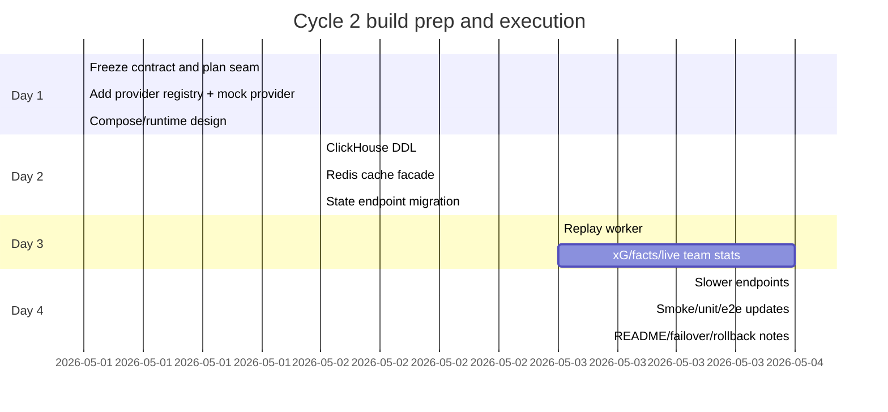

# Cycle 2 Build Guide for the edfp19 widget repo

## Executive Summary

This build interview is fundamentally a **data-layer migration exercise**, not a frontend rewrite and not a “design a perfect platform” exercise. The current repo already gives you a stable public contract: a Tornado API, an embeddable vanilla-JS widget, a configurator, Docker Compose, API smoke tests, and Playwright checks. The Cycle 2 brief explicitly says the user-visible behavior must stay the same; the data layer changes from mock JSON to a real analytical store with ingestion, caching, replication/failover, and backups. That means your safest and highest-signal strategy is:

1. **Freeze the Cycle 1 contract first.**  
2. **Insert a provider seam behind the handlers.**  
3. **Stand up ClickHouse + Redis + a replay worker in Compose.**  
4. **Migrate one endpoint family at a time, starting with match state.**  
5. **Keep the mock provider behind a flag as your rollback path.**  
6. **Prove one live ingest → invalidate cache → widget refresh flow end-to-end.**  

That sequence fits both the repo structure and the Cycle 2 evaluation criteria: schema fit, ingestion robustness, cache discipline, failover behavior, operational sense, and README clarity. Your own profile repo suggests your strength is already strong Python/SQL/data work, so the key is to organize that strength into a demoable service plan rather than over-engineering transport or UI changes. fileciteturn91file0L1-L1 fileciteturn74file0L1-L1 fileciteturn75file0L1-L1 fileciteturn76file0L1-L1 fileciteturn89file0L1-L1 fileciteturn90file0L1-L1 fileciteturn92file0L1-L1

The two required GitHub sources I used first are:
- `github.com/edfp19/edfp19`
- `github.com/edfp19/widget`

I also used your uploaded Cycle‑2 task brief as the starting point for scope and prioritization. I did **not** rely on optional external docs to produce the implementation structure below. fileciteturn92file0L1-L1 fileciteturn91file0L1-L1

## Current Baseline and What Must Not Change

The `widget` repo is already shaped for a backend data-source swap. The backend exposes stable routes under `/api/v1`, all successful responses use the same envelope, TTLs are documented per endpoint, the frontend boot path depends on those routes and payloads, and the tests already assert the contract rather than implementation details. That is exactly why the first thing you should protect is the API surface, not the current JSON I/O path. fileciteturn74file0L1-L1 fileciteturn75file0L1-L1 fileciteturn76file0L1-L1 fileciteturn89file0L1-L1

The most important existing files for the build are:

| Purpose | File | Why it matters |
|---|---|---|
| Contract freeze | [`API.md`](https://github.com/edfp19/widget/blob/main/API.md#L1-L999) | Canonical paths, envelope, and TTLs |
| Route map | [`backend/server.py`](https://github.com/edfp19/widget/blob/main/backend/server.py#L1-L999) | Defines the handlers you should preserve |
| Backend seam | [`backend/handlers/base.py`](https://github.com/edfp19/widget/blob/main/backend/handlers/base.py#L1-L999) | Current shared JSON-loading and envelope logic |
| Hot endpoint to migrate first | [`backend/handlers/state.py`](https://github.com/edfp19/widget/blob/main/backend/handlers/state.py#L1-L999) | Shortest TTL, drives live widget behavior |
| Split-based endpoint | [`backend/handlers/team_stats.py`](https://github.com/edfp19/widget/blob/main/backend/handlers/team_stats.py#L1-L999) | Good model for query-param keyed cache keys |
| Frontend boot contract | [`frontend/loader.js`](https://github.com/edfp19/widget/blob/main/frontend/loader.js#L1-L999) | Shows what the widget fetches and when |
| Live polling behavior | [`frontend/container.js`](https://github.com/edfp19/widget/blob/main/frontend/container.js#L1-L999) | Tells you what “live enough” means operationally |
| Local runtime | [`docker-compose.yml`](https://github.com/edfp19/widget/blob/main/docker-compose.yml#L1-L999) | Current one-service baseline to extend |
| Backend verification | [`tests/test_api_smoke.py`](https://github.com/edfp19/widget/blob/main/tests/test_api_smoke.py#L1-L999) | Existing contract assertions you should preserve |
| Browser verification | [`tests/e2e/widget.spec.js`](https://github.com/edfp19/widget/blob/main/tests/e2e/widget.spec.js#L1-L999) | Live/render behavior you must not break |

The key invariant is: **the widget reads APIs, not files**. Today those APIs happen to read JSON from disk via `BaseHandler.load_mock_json()`. Your build should replace that data source, not the public shape above it. fileciteturn76file0L1-L1 fileciteturn77file0L1-L1 fileciteturn85file0L1-L1 fileciteturn86file0L1-L1

```mermaid
flowchart LR
    A[Widget embed loader] --> B[/api/v1 endpoints]
    B --> C[Tornado handlers]
    C --> D[BaseHandler helpers]
    D --> E[Mock JSON today]

    subgraph Cycle 2 target
      C --> F[Provider registry]
      F --> G[Redis cache]
      G --> H[ClickHouse serving tables]
      I[Replay worker] --> H
    end
```

## Prioritized Implementation Chunks

The table below is the to-do list I would follow. It is deliberately small-chunked so you can work in Codex Pro without losing control of the architecture.

### Priority chunk list

| Chunk | Priority | Est. hours | Goal | Acceptance criteria | Existing files to edit | New files to add |
|---|---:|---:|---|---|---|---|
| C1. Freeze the contract | Highest | 1.5 | Extract the route/TTL matrix and mark invariants | You can name every endpoint, TTL, and query param without looking | [`API.md`](https://github.com/edfp19/widget/blob/main/API.md#L1-L999), [`tests/test_api_smoke.py`](https://github.com/edfp19/widget/blob/main/tests/test_api_smoke.py#L1-L999) | `docs/cycle2_contract_notes.md` |
| C2. Add provider seam | Highest | 2.5 | Replace direct `load_mock_json()` dependency with a provider boundary | Handlers call a provider, not file reads; mock provider still works | [`backend/handlers/base.py`](https://github.com/edfp19/widget/blob/main/backend/handlers/base.py#L1-L999), [`backend/server.py`](https://github.com/edfp19/widget/blob/main/backend/server.py#L1-L999), handlers under `backend/handlers/` | `backend/providers/base.py`, `backend/providers/mock.py`, `backend/providers/registry.py` |
| C3. Extend Compose/runtime | Highest | 2.5 | Add ClickHouse, Redis, and worker services without breaking local dev | `docker compose up --build` starts API + DB + cache + worker | [`docker-compose.yml`](https://github.com/edfp19/widget/blob/main/docker-compose.yml#L1-L999), [`backend/Dockerfile`](https://github.com/edfp19/widget/blob/main/backend/Dockerfile#L1-L999), [`pyproject.toml`](https://github.com/edfp19/widget/blob/main/pyproject.toml#L1-L999) | `.env.example`, `backend/worker.Dockerfile` |
| C4. Create minimal CH schema | Highest | 3 | Define raw events + latest state + serving tables | DDL exists, boots in Compose, and supports at least one full live path | none required | `sql/001_init.sql`, optionally `sql/002_views.sql` |
| C5. Add Redis cache facade | Highest | 3 | Centralize keying, TTL, and invalidation | Cache TTLs match `API.md`; miss/hit path is explicit | [`backend/handlers/base.py`](https://github.com/edfp19/widget/blob/main/backend/handlers/base.py#L1-L999) or provider call sites | `backend/services/cache.py` |
| C6. Implement state first | Highest | 4 | Migrate `/match/{id}/state` off mock files | State endpoint works from provider/cache/CH and existing tests still pass | [`backend/handlers/state.py`](https://github.com/edfp19/widget/blob/main/backend/handlers/state.py#L1-L999), [`frontend/container.js`](https://github.com/edfp19/widget/blob/main/frontend/container.js#L330-L999) only if needed | `backend/providers/clickhouse.py` |
| C7. Add replay worker | Highest | 5 | Simulate inbound updates and write them into CH | One ingest event updates storage, invalidates cache, and appears in widget within ~1s | none required | `backend/worker/replay.py`, `backend/worker/events.py`, maybe `scripts/replay_demo.py` |
| C8. Migrate xG + facts + live team stats | High | 5 | Complete the “live demo” path | xG/facts/live stats refresh correctly on live events | [`backend/handlers/xg_race.py`](https://github.com/edfp19/widget/blob/main/backend/handlers/xg_race.py#L1-L999), [`backend/handlers/facts.py`](https://github.com/edfp19/widget/blob/main/backend/handlers/facts.py#L1-L999), [`backend/handlers/team_stats.py`](https://github.com/edfp19/widget/blob/main/backend/handlers/team_stats.py#L1-L999) | maybe `backend/queries/*.sql` |
| C9. Migrate slower endpoints | Medium | 4 | Move table/fixtures/h2h/squads to provider-backed reads | All current endpoint families resolve without mock file dependency | [`backend/handlers/table.py`](https://github.com/edfp19/widget/blob/main/backend/handlers/table.py#L1-L999), [`backend/handlers/fixtures.py`](https://github.com/edfp19/widget/blob/main/backend/handlers/fixtures.py#L1-L999), [`backend/handlers/h2h.py`](https://github.com/edfp19/widget/blob/main/backend/handlers/h2h.py#L1-L999), [`backend/handlers/squads.py`](https://github.com/edfp19/widget/blob/main/backend/handlers/squads.py#L1-L999) | provider methods only if enough |
| C10. Tests, failover, README | Highest | 4 | Lock behavior and explain tradeoffs | Existing smoke/e2e pass, one ingest test exists, one failover scenario is documented or automated | [`tests/test_api_smoke.py`](https://github.com/edfp19/widget/blob/main/tests/test_api_smoke.py#L1-L999), [`tests/e2e/widget.spec.js`](https://github.com/edfp19/widget/blob/main/tests/e2e/widget.spec.js#L1-L999), [`README.md`](https://github.com/edfp19/widget/blob/main/README.md#L1-L999) | `tests/test_provider_cache.py`, `tests/test_ingest_replay.py`, `docs/cycle2_design.md` |

### Why this order is the right order

This order follows the repo’s actual shape. The route map is stable in `server.py`; the current seam is `BaseHandler`; the frontend is already contract-driven; the smoke tests already verify TTLs and error envelopes. So the highest-value move is to insert a provider seam, not to start with infrastructure or schema in isolation. If you do infra first, you risk building away from the contract. If you do the seam first, everything else becomes incremental. fileciteturn75file0L1-L1 fileciteturn76file0L1-L1 fileciteturn85file0L1-L1 fileciteturn89file0L1-L1

## Four-Day Schedule You Can Actually Follow

This fits your accepted assumption of 6–8 hours per day. If you get a fifth day, use it for cleanup, replay demos, and README polish.



### Day-by-day block schedule

| Day | Block | Chunks |
|---|---|---|
| Day 1 | Morning | C1 contract freeze, route/TTL matrix, provider interface sketch |
| Day 1 | Afternoon | C2 provider seam, mock provider preserved |
| Day 1 | Evening | C3 Compose/runtime design, env names, service names |
| Day 2 | Morning | C4 ClickHouse DDL and storage model |
| Day 2 | Afternoon | C5 Redis cache facade |
| Day 2 | Evening | C6 `/match/{id}/state` migration and smoke check |
| Day 3 | Morning | C7 replay worker and sample event payloads |
| Day 3 | Afternoon | C8 xG, facts, live team stats path |
| Day 3 | Evening | Validate “ingest → cache invalidate → widget refresh” |
| Day 4 | Morning | C9 slower endpoints |
| Day 4 | Afternoon | C10 tests |
| Day 4 | Evening | README/design note, rollback, failover commands |

If you only have **three days**, compress by keeping the same order but delaying slower endpoints and documenting partial support explicitly. The highest-scoring deliverable is not “all endpoints migrated perfectly”; it is “a defensible architecture, one crisp live path, preserved contract, and operational reasoning.” That emphasis comes directly from the Cycle‑2 brief.  

## Core Implementation Guide by Chunk

### C1. Freeze the contract

Start by extracting the exact endpoint/TTL matrix from `API.md`. The repo documents the stable envelope plus the endpoint TTLs you are expected to honor at the cache layer: `state=5`, `table=300`, `fixtures=60`, `xg-race=10`, `squads=60`, `team-stats=120`, `team/{id}/stats=120`, `h2h=300`, `h2h/players=300`, `facts=15`. The smoke tests already assert these same values, which is why you should treat them as fixed acceptance criteria. fileciteturn74file0L1-L1 fileciteturn89file0L1-L1

**Starter Codex Pro prompt**

```text
Read API.md and tests/test_api_smoke.py in this repo and produce a single markdown file named docs/cycle2_contract_notes.md that lists:
- every endpoint path
- query params
- TTL
- required invariants that must not change in Cycle 2
- the riskiest frontend dependencies on each endpoint
Do not change runtime code yet.
```

**What to say in the interview about this chunk**

“I froze the public contract first because the repo already has a stable API and browser verification. That let me change the data layer without risking the embed contract.”

### C2. Add the provider seam

Today each handler reads JSON directly from disk. The exact seam to replace is the handler call pattern around `load_mock_json()` in `BaseHandler` and the individual endpoint handlers. Preserve the handlers and their validation/envelope logic, but route all data access through a provider registry selected by config. That gives you a clean rollback path back to the mock provider. fileciteturn76file0L1-L1 fileciteturn77file0L1-L1 fileciteturn78file0L1-L1 fileciteturn79file0L1-L1

**Best existing touch points**
- [`backend/handlers/base.py`](https://github.com/edfp19/widget/blob/main/backend/handlers/base.py#L1-L999)
- [`backend/handlers/state.py`](https://github.com/edfp19/widget/blob/main/backend/handlers/state.py#L1-L999)
- [`backend/server.py`](https://github.com/edfp19/widget/blob/main/backend/server.py#L1-L999)

**Paste-ready provider interface**

```python
# backend/providers/base.py
from __future__ import annotations
from typing import Any, Protocol

class WidgetDataProvider(Protocol):
    async def get_match_state(self, match_id: str) -> dict[str, Any]: ...
    async def get_competition_table(self, competition_id: str) -> list[dict[str, Any]]: ...
    async def get_competition_fixtures(
        self, competition_id: str, *, status: str | None, limit: int
    ) -> list[dict[str, Any]]: ...
    async def get_match_xg_race(self, match_id: str) -> dict[str, Any]: ...
    async def get_match_squads(self, match_id: str) -> dict[str, Any]: ...
    async def get_match_team_stats(self, match_id: str, *, split: str) -> dict[str, Any]: ...
    async def get_team_stats(self, team_id: str, *, split: str) -> dict[str, Any]: ...
    async def get_match_h2h(self, match_id: str, *, limit: int) -> list[dict[str, Any]]: ...
    async def get_match_h2h_players(
        self,
        match_id: str,
        *,
        home_player_id: str | None,
        away_player_id: str | None,
    ) -> dict[str, Any]: ...
    async def get_match_facts(
        self, match_id: str, *, category: str | None, limit: int
    ) -> list[dict[str, Any]]: ...
```

**Starter Codex Pro prompt**

```text
Create a provider abstraction for the widget backend.

Constraints:
- Preserve all existing handler validation and response-envelope logic.
- Do not change endpoint paths or payload shapes.
- Add backend/providers/base.py, backend/providers/mock.py, backend/providers/registry.py.
- Mock provider should reuse the current mock JSON files and behave exactly like today.
- Handlers should call provider methods, not load_mock_json directly.
- Keep this change mechanical and small.
```

### C3. Extend Compose/runtime

The current Compose file only runs `api`, and the image only needs Tornado plus a small Python dependency set. Cycle 2 requires at least ClickHouse, cache, and a replay/ingest path, so Compose becomes part of the interview deliverable. Keep the service graph simple and local-first. fileciteturn87file0L1-L1 fileciteturn88file0L1-L1 fileciteturn93file0L1-L1

**Best existing touch points**
- [`docker-compose.yml`](https://github.com/edfp19/widget/blob/main/docker-compose.yml#L1-L999)
- [`backend/Dockerfile`](https://github.com/edfp19/widget/blob/main/backend/Dockerfile#L1-L999)
- [`pyproject.toml`](https://github.com/edfp19/widget/blob/main/pyproject.toml#L1-L999)

**Compose service names I would use**
- `api`
- `worker`
- `redis`
- `clickhouse1`
- `clickhouse2`
- `keeper`

**Paste-ready Compose sketch**

```yaml
services:
  api:
    build:
      context: .
      dockerfile: ./backend/Dockerfile
    command: python backend/server.py
    ports:
      - "8080:8080"
    environment:
      PORT: "8080"
      ENV: development
      WIDGET_PROVIDER: clickhouse
      REDIS_URL: redis://redis:6379/0
      CLICKHOUSE_HOST: clickhouse1
      CLICKHOUSE_PORT: "8123"
    depends_on:
      - redis
      - clickhouse1

  worker:
    build:
      context: .
      dockerfile: ./backend/Dockerfile
    command: python -m backend.worker.replay
    environment:
      REDIS_URL: redis://redis:6379/0
      CLICKHOUSE_HOST: clickhouse1
      CLICKHOUSE_PORT: "8123"
    depends_on:
      - redis
      - clickhouse1

  redis:
    image: redis:7

  clickhouse1:
    image: clickhouse/clickhouse-server:latest

  clickhouse2:
    image: clickhouse/clickhouse-server:latest

  keeper:
    image: clickhouse/clickhouse-keeper:latest
```

**Starter Codex Pro prompt**

```text
Update docker-compose.yml for Cycle 2.

Add:
- Redis
- two ClickHouse replicas
- one Keeper
- one replay worker

Keep:
- api service on port 8080
- local development ergonomics
- existing health checks if practical

Do not change frontend behavior.
```

### C4. Minimal ClickHouse schema and replay worker plan

The brief strongly suggests that the “right” model is not a separate event vocabulary translated into a different read model. Instead, the inbound payload should resemble the same resource shape your API already serves. That means your fastest credible model is:

- **Raw append-only events** for replay and recovery
- **Latest-state serving table** for `/state`
- **Append-only xG/facts rows** for `/xg-race` and `/facts`
- **Serving snapshots or aggregates** for team stats / table / fixtures if you have time

That is enough to get a real live path working without inventing the entire world.  

**Recommended new files**
- `sql/001_init.sql`
- `sql/002_seed.sql` or `sql/002_views.sql`
- `backend/worker/replay.py`
- `backend/worker/events.py`

**Minimal DDL**

```sql
CREATE TABLE raw_match_events
(
    match_id String,
    event_id String,
    event_ts DateTime64(3),
    event_type LowCardinality(String),
    payload_json String
)
ENGINE = MergeTree
PARTITION BY toDate(event_ts)
ORDER BY (match_id, event_ts, event_id);

CREATE TABLE match_state_latest
(
    match_id String,
    version_ts DateTime64(3),
    competition_id String,
    phase LowCardinality(String),
    clock UInt16,
    home_score UInt8,
    away_score UInt8,
    home_team String,
    away_team String,
    lineups_confirmed UInt8,
    kickoff_utc DateTime
)
ENGINE = ReplacingMergeTree(version_ts)
ORDER BY (match_id);

CREATE TABLE match_xg_events
(
    match_id String,
    event_ts DateTime64(3),
    minute UInt16,
    side LowCardinality(String),
    xg Float32
)
ENGINE = MergeTree
PARTITION BY toDate(event_ts)
ORDER BY (match_id, minute, event_ts);

CREATE TABLE match_facts
(
    match_id String,
    fact_ts DateTime64(3),
    minute UInt16,
    category LowCardinality(String),
    headline String,
    detail String
)
ENGINE = MergeTree
PARTITION BY toDate(fact_ts)
ORDER BY (match_id, category, minute, fact_ts);
```

**Replay worker implementation plan**

1. Load a deterministic list of simulated events from a local fixture file or generator.  
2. Write each inbound payload to `raw_match_events`.  
3. Upsert the current latest state row for the match.  
4. Insert xG or facts rows when the event carries them.  
5. Invalidate match-scoped Redis keys.  
6. Sleep for the next event delay or provide a CLI “step one event” mode.  

**Replay worker skeleton**

```python
# backend/worker/replay.py
from __future__ import annotations
import asyncio

async def main() -> None:
    events = await load_demo_events()
    for event in events:
        await persist_raw_event(event)
        await update_serving_tables(event)
        await invalidate_affected_cache_keys(event)
        await asyncio.sleep(event.get("delay_seconds", 0.5))

if __name__ == "__main__":
    asyncio.run(main())
```

**Starter Codex Pro prompt**

```text
Create the minimal ClickHouse schema and replay worker for Cycle 2.

Design goals:
- preserve current API contract
- optimize for one working end-to-end live path first
- store raw replayable events
- maintain a latest-state serving table for match state
- maintain append-only xg and facts rows
- invalidate Redis keys after writes

Deliver files:
- sql/001_init.sql
- backend/worker/replay.py
- backend/worker/events.py

Keep the payload model close to the existing API response shapes.
```

### C5. Redis cache integration plan

The brief says TTLs must be enforced in the cache layer, not just headers. The repo already documents the TTL budget, so do not invent new numbers unless the brief forces it. fileciteturn74file0L1-L1

### TTL matrix and invalidation rules

| Endpoint | TTL | Suggested key pattern | Invalidate on |
|---|---:|---|---|
| `/match/{id}/state` | 5s | `widget:v1:match:{id}:state` | any live state mutation |
| `/competition/{id}/table` | 300s | `widget:v1:competition:{id}:table` | result finalization or snapshot refresh |
| `/competition/{id}/fixtures?status=&limit=` | 60s | `widget:v1:competition:{id}:fixtures:{status}:{limit}` | fixture status update |
| `/match/{id}/xg-race` | 10s | `widget:v1:match:{id}:xg-race` | shot/xg/goal event |
| `/match/{id}/squads` | 60s | `widget:v1:match:{id}:squads` | lineup confirm, substitution, card badge update |
| `/match/{id}/team-stats?split=` | 120s | `widget:v1:match:{id}:team-stats:{split}` | live stat mutation for `live`; snapshot refresh for others |
| `/team/{id}/stats?split=` | 120s | `widget:v1:team:{id}:stats:{split}` | aggregate refresh |
| `/match/{id}/h2h?limit=` | 300s | `widget:v1:match:{id}:h2h:{limit}` | rarely; TTL-only is fine |
| `/match/{id}/h2h/players` | 300s | `widget:v1:match:{id}:h2h:players:{home}:{away}` | TTL-only is fine |
| `/match/{id}/facts?category=&limit=` | 15s | `widget:v1:match:{id}:facts:{category}:{limit}` | new fact event |

**Paste-ready cache helper**

```python
# backend/services/cache.py
from __future__ import annotations
import json
from typing import Any, Awaitable, Callable

class CacheService:
    def __init__(self, client):
        self.client = client

    async def get_json(self, key: str) -> Any | None:
        value = await self.client.get(key)
        return None if value is None else json.loads(value)

    async def set_json(self, key: str, value: Any, ttl_seconds: int) -> None:
        await self.client.set(key, json.dumps(value, ensure_ascii=False), ex=ttl_seconds)

    async def get_or_set(
        self,
        *,
        key: str,
        ttl_seconds: int,
        loader: Callable[[], Awaitable[Any]],
    ) -> Any:
        cached = await self.get_json(key)
        if cached is not None:
            return cached
        value = await loader()
        await self.set_json(key, value, ttl_seconds)
        return value
```

**Cache naming principle**

Always include:
- contract version
- resource scope (`match`, `competition`, `team`)
- identifier
- query dimensions (`split`, `status`, `category`, `limit`)
- nothing ephemeral beyond those dimensions

**Starter Codex Pro prompt**

```text
Add Redis cache integration for the widget backend.

Requirements:
- enforce API.md TTLs in Redis
- centralize key naming in one module
- use cache-aside reads
- add explicit invalidation helpers for match-scoped live keys
- do not change response shapes or headers
- start with match state, xg-race, facts, and team-stats
```

### C6–C9. Endpoint migration sequence

Do **not** migrate all endpoints at once. Move in this order:

1. `state`
2. `xg-race`
3. `facts`
4. `match team-stats` live split
5. `squads`
6. slower endpoints: `table`, `fixtures`, `h2h`, legacy stats

That order follows the frontend’s operational importance. The loader fetches `state` during boot and the container polls it during live operation; `xg-race`, `facts`, and live `team-stats` are the clearest demo path for “ingest → invalidate → update.” Squads matter because live badges and lineups-confirmed state are phase-sensitive. Table/fixtures/H2H are important but slower and less risky. fileciteturn85file0L1-L1 fileciteturn86file0L1-L1

**Best frontend dependencies to study**
- [`frontend/loader.js`](https://github.com/edfp19/widget/blob/main/frontend/loader.js#L220-L999)
- [`frontend/container.js`](https://github.com/edfp19/widget/blob/main/frontend/container.js#L1-L999)
- [`tests/e2e/widget.spec.js`](https://github.com/edfp19/widget/blob/main/tests/e2e/widget.spec.js#L1-L999)

## Testing, Rollback, and Debugging

The existing smoke tests are your anchor. They already assert the envelope, endpoint path, `cache_ttl`, version, validation failures, and missing-resource paths. That means your best testing strategy is to **keep most smoke assertions unchanged** and only add tests for the new provider/cache/ingest behavior. fileciteturn89file0L1-L1

### Tests to add or modify

| Test area | Action | Existing target | New target |
|---|---|---|---|
| API contract | Keep existing assertions unchanged | [`tests/test_api_smoke.py`](https://github.com/edfp19/widget/blob/main/tests/test_api_smoke.py#L1-L999) | add minimal setup for provider mode |
| Provider registry | New unit test | none | `tests/test_provider_registry.py` |
| Cache behavior | New unit test | none | `tests/test_provider_cache.py` |
| Replay ingest | New integration test | none | `tests/test_ingest_replay.py` |
| Browser live refresh | Extend e2e lightly | [`tests/e2e/widget.spec.js`](https://github.com/edfp19/widget/blob/main/tests/e2e/widget.spec.js#L1-L999) | add one “after replay event, widget reflects update” case |
| Playwright runtime | Keep same base URL and local server model | [`playwright.config.js`](https://github.com/edfp19/widget/blob/main/playwright.config.js#L1-L999) | maybe only environment injection |

### Exact assertions to add

Add one provider/cache unit test that asserts:
- first call to `get_match_state("12345")` reads from ClickHouse path and sets Redis
- second call returns same payload from Redis
- returned shape matches the existing state contract

Add one replay test that asserts:
- after a simulated goal event for match `12345`, `/api/v1/match/12345/state` returns incremented score
- `/api/v1/match/12345/facts?category=live&limit=10` includes a live goal fact
- `/api/v1/match/12345/xg-race` includes the new minute or cumulative value
- cache keys for `state`, `facts`, and `xg-race` were deleted or overwritten

Add one browser test that asserts:
- open `/example`
- trigger or wait for one replayed event
- score or facts panel changes without reloading the page

### Rollback steps

Your safest rollback is architectural, not Git-based:

1. Set `WIDGET_PROVIDER=mock`
2. Disable worker service
3. Bypass Redis reads if needed
4. Leave ClickHouse services running but unused
5. Re-run the existing smoke suite

That works because the current codebase is already mock-driven and the provider seam is specifically designed to preserve that path. fileciteturn76file0L1-L1 fileciteturn77file0L1-L1

### Debugging commands

Assuming the service names above:

```bash
docker compose up --build
docker compose ps
docker compose logs -f api worker redis clickhouse1 clickhouse2 keeper
curl -s http://127.0.0.1:8080/api/health
curl -s http://127.0.0.1:8080/api/v1/match/12345/state | jq
curl -s "http://127.0.0.1:8080/api/v1/match/12345/facts?category=live&limit=10" | jq
curl -s http://127.0.0.1:8080/api/v1/match/12345/xg-race | jq
uv run python -m unittest discover -s tests -p 'test_api_smoke.py'
npm run test:browser
```

If you expose Redis CLI or ClickHouse client utilities, the next two useful checks are:
- list keys matching `widget:v1:*`
- query the latest serving row for `match_id='12345'`

## Code Review Checklist and Interview Talking Points

### Final code review checklist

| Check | Why it matters |
|---|---|
| Public paths unchanged | Frontend and smoke tests depend on them |
| Envelope unchanged | Existing tests assert `meta.endpoint`, `cache_ttl`, `version`, `error/data` rules |
| TTL enforced in Redis, not just headers | Explicit Cycle‑2 requirement |
| Mock provider still available | Fast rollback and simpler tests |
| `state` migrated first | Highest operational leverage |
| Cache keys include query dimensions | Prevents cross-request corruption |
| Replay worker is deterministic | Easier demo, easier debugging |
| One live e2e flow works | Highest interview signal |
| README explains failover and restore | Explicit submission requirement |
| Slower endpoints not overdesigned | The brief rewards judgment, not gratuitous complexity |

### Chunk-by-chunk talking points

| Chunk | Talking point |
|---|---|
| C1 | “I froze the contract first because the repo already encoded the API and TTL guarantees.” |
| C2 | “I inserted a provider seam so the handlers and frontend contract stayed stable.” |
| C3 | “I kept Compose minimal so the demo remains one-command runnable.” |
| C4 | “I separated raw replayable data from hot serving tables.” |
| C5 | “I honored the existing TTLs in Redis and invalidated only the match-scoped hot keys.” |
| C6 | “I migrated state first because the frontend boot and live polling depend on it.” |
| C7 | “I chose a deterministic replay worker over transport complexity to maximize demo reliability.” |
| C8 | “I prioritized the live widgets that best prove ingest, invalidation, and freshness.” |
| C9 | “I migrated the slower endpoints later because they are lower risk and easier to validate once the seam is proven.” |
| C10 | “I treated tests and README as part of the deliverable, not afterthoughts.” |

## Open Questions and Limitations

The repo inspection was high-confidence for routes, TTLs, handlers, tests, and runtime, because those files were directly fetched. The one thing that remains **partly unspecified** is the exact storage topology you will choose for local replication and failover demonstration. The Cycle‑2 brief clearly wants replicas, failover, and backups, but it leaves room for you to choose the lightest defensible local implementation. That is good news: you do not need to solve a production platform problem; you need to present a small, coherent, defensible system with one fully working live path and a preserved contract. fileciteturn74file0L1-L1 fileciteturn91file0L1-L1